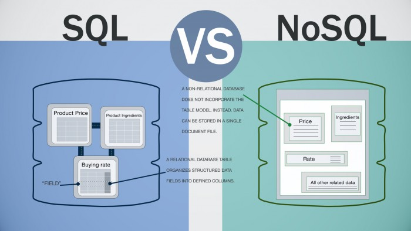

# Lesson 5. MongoDB - простая и удобная база данных

- MongoDB. Устройство и структура. 
- Mongoose
- Интеграция Express.js с MongoDB


## MongoDB. Устройство и структура.

MongoDB — это высокопроизводительная документо-ориентированная база данных без схем данных, которая относиться к не реляционным БД (no SQL).

 **SQL vs NoSQL базы данных**
 


Раньше было обычным делом хранить все данные в реляционных базах данных (MS SQL, MySQL, Oracle, PostgresSQL). При этом было не столь важно, а подходят ли реляционные базы данных для хранения данного типа данных или нет.

В отличие от реляционных баз данных MongoDB предлагает документо-ориентированную модель данных, благодаря чему MongoDB работает быстрее, обладает лучшей масштабируемостью, ее легче использовать.

Но, даже учитывая все недостатки традиционных баз данных и достоинства MongoDB, важно понимать, что задачи бывают разные и методы их решения бывают разные. В какой-то ситуации MongoDB действительно улучшит производительность вашего приложения, например, если надо хранить сложные по структуре данные. В другой же ситуации лучше будет использовать традиционные реляционные базы данных. Кроме того, можно использовать смешенный подход: хранить один тип данных в MongoDB, а другой тип данных - в традиционных БД.

[Статья о разнице между реляционными и нереляционними БД](https://tproger.ru/translations/sql-nosql-database-models/)


### Устройство и структура MongoDB

Если в реляционных бд содержимое составляют таблицы, то в mongodb база данных состоит из коллекций.

Каждая коллекция имеет свое уникальное имя - произвольный идентификатор, состоящий из не более чем 128 различных алфавитно-цифровых символов и знака подчеркивания.

В отличие от реляционных баз данных MongoDB не использует табличное устройство с четко заданным количеством столбцов и типов данных. MongoDB является документо-ориентированной системой, в которой центральным понятием является документ.

Документ можно представить как объект, хранящий некоторую информацию.

Пример документа:
```
{
    "_id": "5bbd9d463131e048a3fb9589",
    "firstName": "Burt",
    "lastName": "Simpson",
    "password": "$2b$10$xIIL/dKw4sbkmg/80zCY2.1yCtZPwSDSZxAXiU0J/imygLH0n8rxu",
    "__v": 0
}
```

Документ представляет набор пар ключ-значение. 

Ключи представляют строки. Значения же могут различаться по типу данных. В данном случае у нас почти все значения также представляют строковый тип, и лишь один ключ (company) ссылается на отдельный объект. Всего имеется следующие типы значений:

- String: строковый тип данных, (для строк используется кодировка UTF-8)
- Array (массив): тип данных для хранения массивов элементов
- Binary data (двоичные данные): тип для хранения данных в бинарном формате
- Boolean: булевый тип данных, хранящий логические значения TRUE или FALSE, например, {"married": FALSE}
- Date: хранит дату в формате времени Unix
- Double: числовой тип данных для хранения чисел с плавающей точкой
- Integer: используется для хранения целочисленных значений, например, {"age": 29}
- JavaScript: тип данных для хранения кода javascript
- Min key/Max key: используются для сравнения значений с наименьшим/наибольшим элементов BSON
- Null: тип данных для хранения значения Null
- Object: строковый тип данных
- ObjectID: тип данных для хранения id документа
- Regular expression: применяется для хранения регулярных выражений
- Symbol: тип данных, идентичный строковому. Используется преимущественно для тех языков, в которых есть специальные символы.
- Timestamp: применяется для хранения времени

### Идентификатор документа (_id)

Для каждого документа в MongoDB определен уникальный идентификатор, который называется _id. При добавлении документа в коллекцию данный идентификатор создается автоматически. Однако разработчик может сам явным образом задать идентификатор, а не полагаться на автоматически генерируемые, указав соответствующий ключ и его значение в документе.

### Mongoose

Mongoose - это библиотека JavaScript, позволяющая вам определять схемы со строго-типизированными данными. Сразу после определения схемы Mongoose дает вам возможность создать Model (модель), основанную на определенной схеме. Затем модель синхронизируется с документом MongoDB с помощью определения схемы модели.

Сразу после определения схем и моделей вы можете пользоваться различными функциями Mongoose для проверки, сохранения, удаления и запроса ваших данных, используя обычные функции MongoDB. Мы еще рассмотрим это более подробно на конкретных примерах.

Mongoose предоставляет огромный набор функциональных возможностей для создания и работы со схемами. На данный момент Mongoose содержит восемь SchemaTypes (* типы данных схемы), которые может иметь свойство, сохраняемое в MongoDB. 

#### Типы данных

- String
- Number
- Date
- Buffer
- Boolean
- Mixed
- ObjectId (* уникальный идентификатор объекта, первичный ключ, _id)
- Array

#### Для каждого типа данных можно:

- задать значение по умолчанию
- задать пользовательскую функцию проверки данных
- указать, что поле необходимо заполнить
- задать get-функцию (геттер), которая позволяет вам проводить манипуляции с данными до их возвращения в виде объекта
- задать set-функцию (* сеттер), которая позволяет вам проводить манипуляции с данными до их сохранения в базу данных
- определить индексы для более быстрого получения данных

Большинство из восьми допустимых типов данных должны быть вам хорошо знакомы. Однако, некоторые (Buffer, Mixed, ObjectId и Array) могут вызвать затруднения.

Тип данных Buffer позволяет вам сохранять двоичные данные. Типичным примером двоичных данных может послужить изображение или закодированный файл, например, документ в PDF-формате (* формат переносимого документа).

### Установка Mongoose

Для того чтобы подключить Mongoose к базе данных.

```
const mongoose = require('mongoose');
 
mongoose.connect('mongodb://localhost/mongoose_basics', function (err) {
 
   if (err) throw err;
 
   console.log('Successfully connected');
 
});
```

Функция connect принимает еще два других необязательных параметра. Второй параметр - объект опций, где вы можете указать, при необходимости, например, username (имя пользователя) и password (пароль). Третий параметр, который также может быть и вторым, если у вас не определены опции, - это функция обратного вызова, которая будет вызвана после попытки соединения с базой данных.

### Определение Mongoose Schema (* схемы)

Для того чтобы записывать данные в базу данных нужно создать схему:

Например схема автора:

```
const authorSchema = mongoose.Schema({
    name: {
        firstName: String,
        lastName: String
    },
    biography: String,
    twitter: String,
    facebook: String,
    linkedin: String,
    profilePicture: Buffer,
    created: { 
        type: Date,
        default: Date.now
    }
});
```

Схема книги:

```
const bookSchema = mongoose.Schema({
    title: String,
    summary: String,
    isbn: String,
    thumbnail: Buffer,
    author: { 
        type: mongoose.Schema.Types.ObjectId, 
        ref: 'Author'
    },
    ratings: [
        {
            summary: String,
            detail: String,
            numberOfStars: Number,
            created: { 
                type: Date,
                default: Date.now
            }
        }
    ],
    created: { 
        type: Date,
        default: Date.now
    }
});
```

### Создание и сохранение Mongoose Models (* моделей)

Далее нужно сохранить эти 2 модели в базу данных.

```
const Author = mongoose.model('Author', authorSchema);
 
const Book = mongoose.model('Book', bookSchema);
```

После сохранения модели в MongoDB создается Document (* документ) с теми же свойствами, что определены в схеме, на основе которой была создана модель.

### Сохранение документов в базу данных

```
const author = new Author {
    name: {
        firstName: 'John',
        lastName: 'Smith'
    },
    biography: 'Some data',
    twitter: 'https://twitter.com/',
    facebook: 'https://www.facebook.com/'
};
 
author.save((err) => {
    if (err) throw err;
     
    console.log('Author successfully saved.');
     
    const mvcBook = new Book {
        title: 'ASP.NET MVC 5 with Bootstrap and Knockout.js',
        author: jamieAuthor._id,
        ratings:[{
            summary: 'Great read'
        }]
    };
     
    mvcBook.save(function(err) {
        if (err) throw err;
     
        console.log('Book successfully saved.');
    });
});
```
 
В примере создается автор, а после автора книга. Если сохранение не удалось, то в коллбек приходит ошибка.

### Поиск и обновление данных

Mongoose предоставляет несколько различных функций для поиска данных определенной модели. Эти функции следующие: find, findOne и findById.

Функции find и findOne получают в качестве аргумента объект, позволяющий осуществлять сложные запросы. Функция же findById получает только одно значение функции обратного вызова (скоро будет пример). В следующем примере я продемонстрирую вам, как можно сделать выборку книг, содержащих в своем названии строку 'mvc'.

```
Book
    .find({ title: /mvc/i })
    .exec(function(err, books) {
        if (err) throw err;
        console.log(books);
    });
```
Внутри функции find я осуществляю поиск нечувствительной к регистру строки 'mvc' по свойству title. Это осуществляется с помощью того же синтаксиса, что используется для поиска строки в JavaScript.

Функцию find таккже можно "прицепить" к другим методам запроса, например, where, and, or, limit, sort, any и т.д.

```
Book
    .find({ title: /mvc/i })
    .sort('-created')
    .limit(5)
    .exec(function(err, books) {
        if (err) throw err;
         
        console.log(books);
    });
```

### Проверка данных перед сохранением

В Mongoose можно добавить проверку для любых данных. Например для следующих свойств: firstName, twitter, facebook и linkedin.

```
var authorSchema = mongoose.Schema({
    name: {
        firstName: {
            type: String,
            required: true
        },
        lastName: String
    },
    biography: String,
    twitter: {
        type: String,
        validate: {
            validator: function(text) {
                return text.indexOf('https://twitter.com/') === 0;
            },
            message: 'Twitter handle must start with https://twitter.com/'
        }
    },
    facebook: {
        type: String,
        validate: {
            validator: function(text) {
                return text.indexOf('https://www.facebook.com/') === 0;
            },
            message: 'Facebook must start with https://www.facebook.com/'
        }
    },
    linkedin: {
        type: String,
        validate: {
            validator: function(text) {
                return text.indexOf('https://www.linkedin.com/') === 0;
            },
            message: 'LinkedIn must start with https://www.linkedin.com/'
        }
    },
    profilePicture: Buffer,
    created: { 
        type: Date,
        default: Date.now
    }
});
```

- [Статья о mongoose](https://code.tutsplus.com/ru/articles/an-introduction-to-mongoose-for-mongodb-and-nodejs--cms-29527)
- [Видео о mongoose](https://www.youtube.com/watch?v=WDrU305J1yw&t=479s)

## Как создать базу данных
[Инструкция](https://docs.mlab.com/)

## Домашнее задание

1. Создать базу данных для своего проекта (бесплатную)
  - https://docs.mlab.com/
  - либо же здесь https://www.mongodb.com/cloud/atlas
2. Подключить базу данных к проекту (как в демо).
3. Подключить к проекту mongoose и создать коллекции что указаны ниже

4. Сделать чтобы данные пользователя вместо сохранения в файл сохранялись в базу данных в колекцию `users`
5. К пользователю добавить поля `favoriteProducts: Array`,  `viewedProducts: Array`, `orders: Array`. В каждом масиве будут `id` любимых или просмотреных товаров. В Orders будет массив из заказов.
6. Добавить роут  `PUT user/:id` который в `body` шлет одно из полей выше с новым значением. После получения запроса пользователь в базе должен обновится. В ответ бекенд отправляет 

```
 {
  "status": "success", 
  "product": <updated-user>
 }
```

7. Создать коллекцию `orders` в которой будут лежать заказы
8. Создать роут `POST orders` на который нужно слать в `BODY` следующие данные

```
 {,
  "creator": <userId>,
  "productsList": [
    { 
      product: <productId>,
      type: "M" || "XL" || "XXL",
      itemsCount: <number> 
    }
  ],
  "deliveryType": "delivery" || "office",
  "deliveryAdress": <some address>,
  "sumToPay": Number (пример: "600"),
  "status": "inProgress" || "declined" || "finished" || "failed"
 }
```

9. Создать роут `GET orders/:id` который может получить определенный заказ по id заказа
```
 {
  "status": "success", 
  "order": <order>
 }
```

10. Переместить продукты в коллекцию `products`
11. К товару добавить поле `likes: Number`, 
12. К товару добавить PUT запрос `products/:id` который в `body` шлет одно из полей выше с новым значением. После получения запроса товар в базе должен обновится. В ответ бекенд отправляет 
```
 {
  "status": "success", 
  "product": <updated-product>
 }
```


