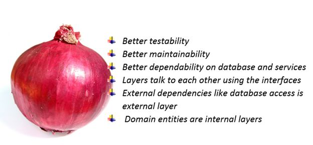

# Lesson 8

- Дизайн гибкой архитектуры в node.js
 
## Дизайн чистой архитектуры в node.js 

Плохая архитектура характеризуется 2мя терминами: 
- **хрупкостью**  приложение ломается в местах которые не связаны с вносимыми изменениями.
- **жесткостью** для добавление даже тривиальной новой фичи приходится вносить очень много изменений во много модулей приложения

Приложение становится похожим на стекло. Оно готово разбится при любом неудобном движении.
 
### Зачем делать "чистую" архитектуру

Она нужна для того чтобы:

 - отделить бизнес логику от деталей реализации
 - быть независимыми от базы данных, фреймворка или библиотеки
 - использовать чистые функции где только можно
 - упростить тестирование проекта
 - сделать добавление новых фич очень простым
 - сделать перенос логики очень простым

### Луковая архитектура

Хорошим примером гибкой архитектуры является **Onion architecture** (Луковая архитектура). 

Особенностью архитектуры является то, что она состоит из разных слоев логики и данных, которые похожи на слои лука.
Зная что нужно сейчас сделать мы понимаем в каком слое мы должны писать определенную логику.

### Onion architecture в деталях

Абстракции в примерах:

**Core, ядро системы**

- стоительные блоки с которых вы будете делать приложение
- логика которая не зависит от конкретного приложения
- в большинстве это чистые функции, которые получают определеннные данных и возвращают другие
- в Core никогда не должно быть импортов методов базы данных либо же request, response   
- Core не знает о других слоях вообще

**Domain, доменный слой**
- в этом слое находится логика вашего приложения
- использует фукцнии из Сore и связывает их в логику
- в домене не иcпользуются методы express
- в домене можно использовать DB
- вся структура должна быть разделена по сущностям нашего приложения (users, products, orders) 
 
**API, Gateway**

Все эти названия обозначают одно и тоже. Это фасад для работы с Domain и Core логикой вашего приложения

- должен возввращать имутабельные обьекты (чтобы исключить возможность мутации их в других модулях)
- может работать с Core и Domain модулями, но ничего не знает об Infrastructure

Пример методов в API:

* createOrder
* addProductToCart
* removeProductFromCart

* createUser
* login
* logout

**Infrastructure**

Слой который работает с базой данных и express напрямую

**Правило зависимости**

Круги представляют различные области программного обеспечения. В общем, чем дальше, тем выше уровень программного обеспечения. Внешние круги - это механизмы. Внутренние круги - это политика.

Главное правило, которое заставляет эту архитектуру работать, - это правило зависимости. Зависимости исходного кода могут указывать только внутрь круга, но не вне. 
Пример: модель не может импортировать в себя ничего из контроллера или сервиса.

**Модули, функции, классы внутреннего круга не могут знать ничего о тех же сущностях внешнго круга**. 

Имя чего-либо, объявленного во внешнем круге, не должно упоминаться кодом во внутреннем круге. Это включает в себя, функции, классы. переменные или любой другой названный программный объект.

Точно так же форматы данных (в нашем случае обьектов), используемые во внешнем круге, не должны использоваться внутренним кругом, особенно если эти форматы создаются структурой во внешнем круге.
Мы не хотим, чтобы что-то во внешнем круге влияло на внутренние круги.

[Статья о луковой архитектуре](https://blog.cleancoder.com/uncle-bob/2012/08/13/the-clean-architecture.html)

