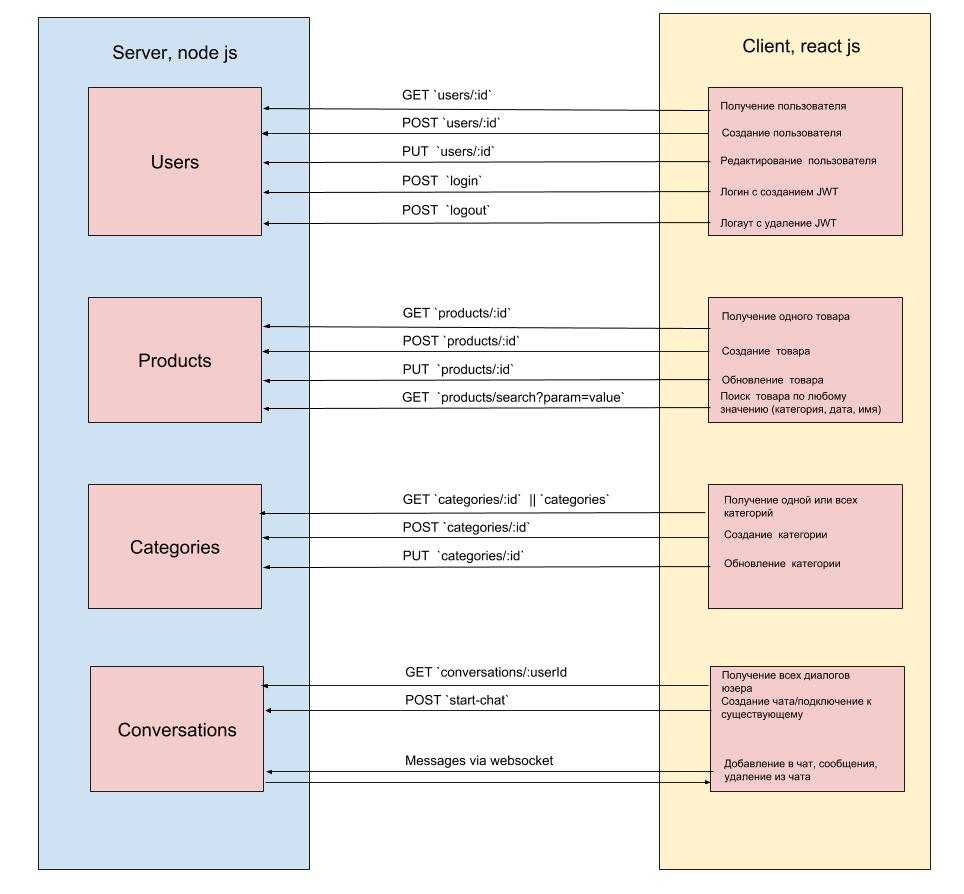

# Lesson 8

- Cross-Origin Resource Sharing (CORS) 
- Подстройка чата для пользователей приложения
- Схема приложения для торговой площадки


### Cross-Origin Resource Sharing (CORS) 

Это механизм, использующий дополнительные HTTP-заголовки, чтобы дать возможность клиенту получать доступ  к выбранным ресурсам с сервера. 

Это происходит когда домен или `origin` с которого отправляется запрос отличается от домена сервера. 

Тогда получается что клиент пользователя делает запрос с другого источника (cross-origin HTTP request), который отличается от запрашиваемого ресурса доменом, протоколом или портом.

Пример cross-origin запроса: HTML страница, обслуживаемая сервером с `http://domain-a.com`, запрашивает  src по адресу `http://domain-b.com/image.jpg`. Сегодня многие страницы загружают ресурсы вроде CSS-стилей, изображений и скриптов с разных доменов.

Браузеры ограничивают cross-origin запросы в целях безопасности. Например, XMLHttpRequest и Fetch API следуют политике одного источника (same-origin policy). Это значит, что web-приложения, использующие такие API, могут запрашивать HTTP-ресурсы только с того домена, с которого были загружены, пока не будут использованы CORS-заголовки.

Обычно CORS запросы отправляются с помощью AJAX запросов.

#### Пример запроса
```
GET /resources/public-data/ HTTP/1.1
Host: bar.other
User-Agent: Mozilla/5.0 (Macintosh; U; Intel Mac OS X 10.5; en-US; rv:1.9.1b3pre) Gecko/20081130 Minefield/3.1b3pre
Accept: text/html,application/xhtml+xml,application/xml;q=0.9,*/*;q=0.8
Accept-Language: en-us,en;q=0.5
Accept-Encoding: gzip,deflate
Accept-Charset: ISO-8859-1,utf-8;q=0.7,*;q=0.7
Connection: keep-alive
Referer: http://foo.example/examples/access-control/simpleXSInvocation.html
Origin: http://foo.example
```

#### Пример ответа
```
HTTP/1.1 200 OK
Date: Mon, 01 Dec 2008 00:23:53 GMT
Server: Apache/2.0.61 
Access-Control-Allow-Origin: *
Keep-Alive: timeout=2, max=100
Connection: Keep-Alive
Transfer-Encoding: chunked
Content-Type: application/html
```


[CORS на MDN](https://developer.mozilla.org/ru/docs/Web/HTTP/CORS)
[Руководство по кросс-доменным запросам (CORS)](https://grishaev.me/cors)

### Схема приложения


